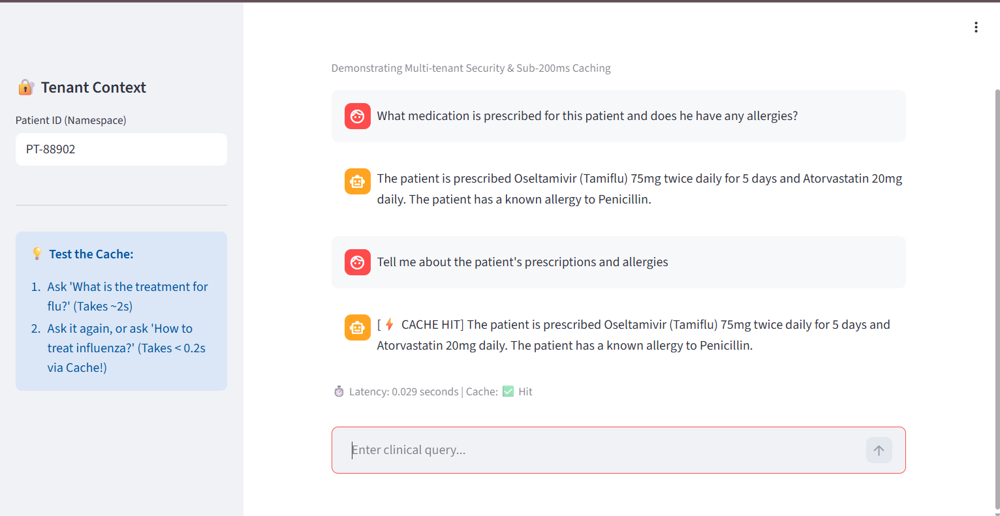
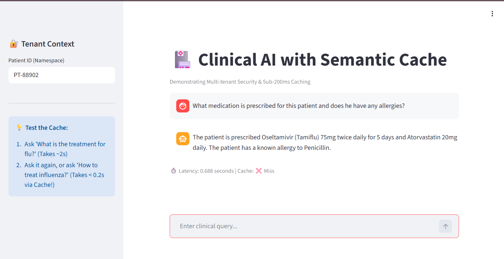
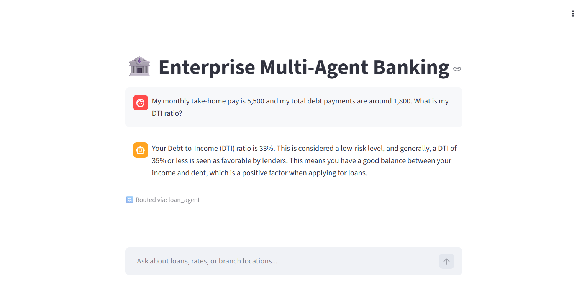
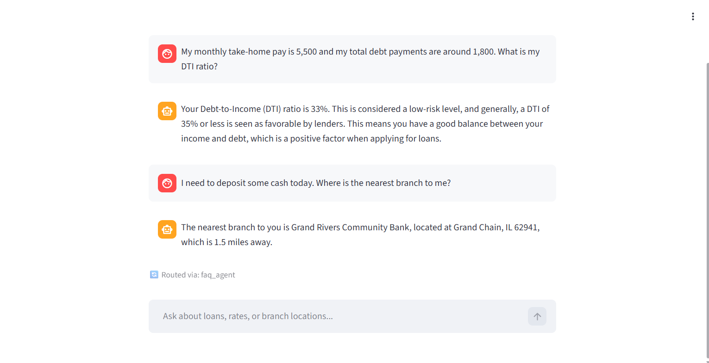
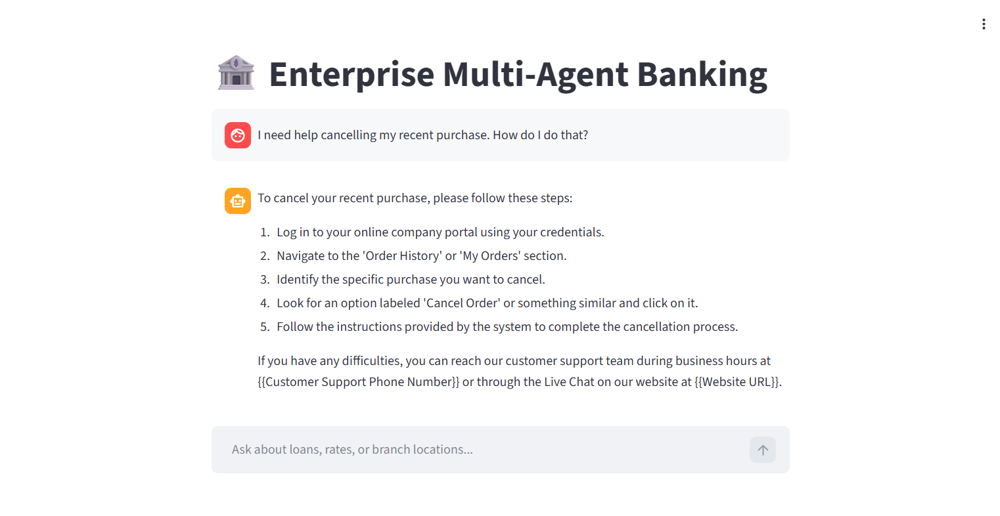
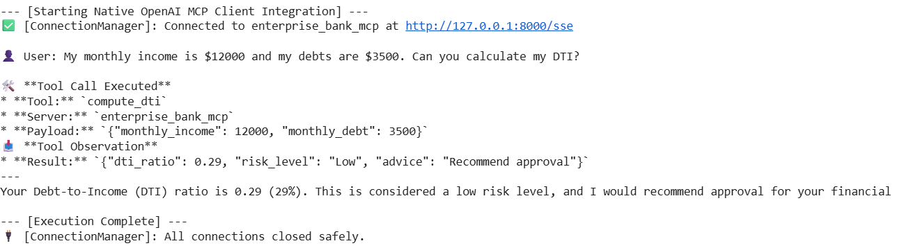
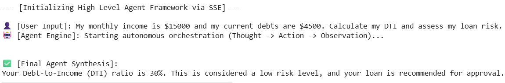
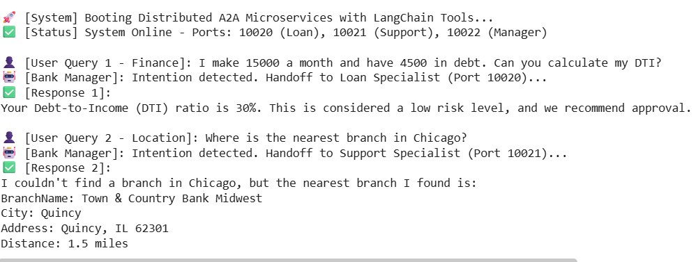

# 🚀 NextGen Agentic AI Ecosystem: Enterprise Multi-Agent & RAG Infrastructure

<div align="center">
  
  
  
  
  
  
</div>

<br>

## 📌 Executive Summary
An enterprise-grade, multi-agent AI ecosystem demonstrating high-performance orchestration, real-time tool execution, and privacy-centric data retrieval. This repository moves beyond basic wrappers to implement **Stateful Graphs, Semantic Caching, and and Distributed Agentic Protocols.**

Engineered for production-readiness, the architecture focuses on **Deterministic Execution**, **Sub-second Latency**, and **Zero-Hallucination** guardrails, specifically tailored for Healthcare and Financial domains.


---

## 🏗️ Core Architectures & Microservices

### 1. 🏥 Clinical RAG Agent (Privacy-First & High-Performance)
A specialized healthcare assistant designed for Electronic Health Records (EHR) with strict security boundaries.

* **Redis-Backed Semantic Caching:** Implements a vector-similarity cache layer using `sentence-transformers`. It reduces API latency from **~3.0s to <100ms** for repeated queries.
* **Multi-tenant Data Isolation:** Leverages **ChromaDB** with dynamic **Metadata Filtering**. Patient records are logically isolated using unique hashed identifiers, ensuring that the Retrieval phase never leaks data across different patient contexts.
* **Audit-Ready Checkpoints:** Integrated with LangGraph’s `SqliteSaver` to persist conversation states, providing a compliant audit trail for medical interactions.

### 2. 🏦 Enterprise Multi-Agent Banking System
A fully autonomous coordinator that manages financial inquiries through strict intent-based routing.

* **Stateful Agentic Routing:** Uses **LangGraph** to manage a directed acyclic graph (DAG). The **Semantic Router** classifies intents (Loan vs. FAQ) to prevent cross-domain contamination.
* **Deterministic Tool Execution:** * **Loan Agent:** Extracts financial entities to execute a deterministic `calculate_dti` tool.
    * **FAQ Agent:** Utilizes an in-memory **FAISS** vector store for blazingly fast retrieval of banking policies from CSV datasets.
* **Conversational Persistence:** Employs `MemorySaver` to maintain thread-specific context, allowing the agent to handle complex, multi-turn follow-up questions.

### 3. 🔌 Advanced Agentic Protocols (Next-Gen PoC)
Located in `src/protocols/`, this section showcases the future of decoupled AI communication.

* **Model Context Protocol (MCP) over SSE:** A decoupled Client-Server architecture allowing LLMs to dynamically discover and execute remote tools via RPC. Includes both low-level native OpenAI SDK integration (`llm_call_mcp_sse.py`) and high-level framework orchestration (`agent_call_mcp_sse.py`).
```Plain text
+-------------------+        Server-Sent Events (SSE)         +-----------------------+
|   LLM / Agent     | --------------------------------------> |    FastMCP Server     |
|   (The Brain)     | <-------------------------------------- |  (The Infrastructure) |
|                   |        JSON-RPC Tool Execution          |                       |
+-------------------+                                         +-------+-------+-------+
                                                                      |       |
                                                                [Bank_Tools] [Vector_DB]
```
* **Distributed A2A Microservices (Google ADK + LangChain):** Implements a hierarchical delegation model where a Coordinator routes tasks to specialized Workers across different network ports. Successfully bridged Google ADK (Proprietary Orchestration) with LangChain-based tools (Open-source Execution) via custom Function Adapters, ensuring sub-second execution and high modularity.

```Plain text
+-----------------------------------------------------------------------+
|                         USER / TEST SCRIPT                            |
+-----------------------------------+-----------------------------------+
                                    |
                          (HTTP / JSON-RPC)
                                    v
+-----------------------------------------------------------------------+
|                BANK MANAGER COORDINATOR (Port 10022)                  |
|                   Model: gemini-2.5-flash                             |
|       (Intent Classification & Dynamic Task Delegation)               |
+-----------------------+-----------------------+-----------------------+
                        |                       |
             [Intent: Finance]          [Intent: Location]
             [Handoff to 10020]         [Handoff to 10021]
                        |                       |
                        v                       v
+------------------------------+       +------------------------------+
|   LOAN SPECIALIST WORKER     |       |  SUPPORT SPECIALIST WORKER   |
|     (Port 10020)             |       |     (Port 10021)             |
+--------------+---------------+       +--------------+---------------+
               |                                      |
       (ADK Tool Adapter)                     (ADK Tool Adapter)
               |                                      |
               v                                      v
+------------------------------+       +------------------------------+
|     LANGCHAIN TOOLS          |       |      LANGCHAIN TOOLS         |
|   (src.bank.tools.bank_tools)|       |  (src.bank.tools.bank_tools) |
+------------------------------+       +------------------------------+
|  > calculate_dti.invoke()    |       | > search_nearest_branch()    |
+------------------------------+       +------------------------------+
```

### 4. 🛒 E-Commerce CS Agent (Stateful HITL & Async API Gateway)

A production-ready Customer Service protocol demonstrating asynchronous concurrency and secure execution pausing.
* **Fully Asynchronous API:** Built with FastAPI and LangGraph's `ainvoke()`, enabling non-blocking I/O that can handle thousands of concurrent requests without dropping connections.
* **Stateful Human-in-the-Loop (HITL):** Utilizes LangGraph's `MemorySaver` checkpointer bound to unique `session_id`s. When the LLM proposes a high-risk action (e.g., executing a Shopify refund), the DAG halts execution and returns a `requires_approval` flag via API. 
* **Cross-Request Resumption:** An admin can review the paused state and trigger the `/v1/agent/approve` webhook to resume the exact graph state perfectly.
---

## 🛡️ Technical Hardening (Engineering Excellence)
* **Zero-Hallucination Guardrails:** Tools are designed with strict "I don't know" fallbacks. If the RAG similarity score is below the safety margin, the system redirects to human support.
* **Model Tiering:** Strategically uses `gemini-2.5-flash` for coordination and `gemini-2.5-flash-lite` for cost-efficient tool execution.
* **Infrastructure Testing:** Built a strict, non-LLM integration test suite (`test_mcp_manual.py`) to verify network and protocol layers before generative model deployment.
* **Resilient Tool Execution:** External API tools are wrapped in strict `try/catch` armor. If a third-party API (like Shopify or Bank ERP) times out, the tool catches the exception and returns the error string to the LLM. The agent dynamically handles the failure by politely apologizing to the user, preventing HTTP 500 server crashes.
* **100% Mocked CI/CD Testing Pipeline:** Integrated a robust `pytest` suite running on GitHub Actions. It leverages `AsyncMock` to freeze asynchronous LLM instances, allowing the pipeline to rigorously test routing logic and API security (X-API-Key) without consuming a single token of API quota.
* **Dockerized Infrastructure:** The entire ecosystem, including the FastAPI gateway and Redis Stack, is containerized via a multi-stage `Dockerfile` and `docker-compose.yml` for seamless, single-command deployment.

---

## 📸 System in Action (Technical Evidence)

**1. Clinical Agent: Semantic Cache Hit (Sub-100ms)**


**2. Bank Agent: Autonomous Routing & Calculation**




**3. Advanced Protocol Execution (Terminal Demo)**




---

## ⚙️ Quickstart & Deployment

**1. Prerequisites:**
```bash
# Install Redis (Required for Clinical Semantic Cache)
# 1. Download and extract Redis Stack (Ubuntu 22.04 Jammy build)
wget [https://packages.redis.io/redis-stack/redis-stack-server-7.2.0-v9.jammy.x86_64.tar.gz](https://packages.redis.io/redis-stack/redis-stack-server-7.2.0-v9.jammy.x86_64.tar.gz)
tar -xvf redis-stack-server-7.2.0-v9.jammy.x86_64.tar.gz

# 2. Start the Vector Database in the background
./redis-stack-server-7.2.0-v9/bin/redis-stack-server --daemonize yes

# 3. Verify the server is running
./redis-stack-server-7.2.0-v9/bin/redis-cli ping

# Clone the repository and install dependencies
git clone [https://github.com/cantricao/NextGen-Agentic-AI.git](https://github.com/cantricao/NextGen-Agentic-AI.git)
cd NextGen-Agentic-AI
pip install -r requirements.txt
```
💡 Architect's Note: Due to recent Redis licensing changes (RSALv2) and the deprecation of native OS package managers for Redis Stack, this architecture strictly enforces containerized deployment via Docker to guarantee immutable infrastructure and Vector Search compatibility

```bash
# Spin up the Redis Stack Vector Database (Port 6379 & UI on 8001)
docker run -d --name redis-stack -p 6379:6379 -p 8001:8001 redis/redis-stack:latest
```

**2. Launch the Applications via Streamlit:** Ensure your .env contains your GOOGLE\_API\_KEY or GEMINI\_API\_KEY.

```bash
# Run Medical Agent (Multi-tenant RAG + Redis)
streamlit run clinical_app.py

# Run Banking Agent (Multi-agent Graph + FAISS)
streamlit run bank_app.py
```

**3. Execute Advanced Protocols (Terminal Demos):**

```bash
# Terminal 1: Start the FastMCP SSE Server in the background
python -m src.protocols.mcp_server

# Terminal 2: Run the Non-LLM Infrastructure Integration Test
python -m tests.protocols.test_mcp_manual

# Terminal 3: Run low-level RPC llm client
python -m src.protocols.llm_call_mcp_sse

# Terminal 4: Run high-level ReAct Agent
python -m src.protocols.mcp_agent_client

# Terminal 5: A2A Distributed Demo
python -m src.protocols.a2a_google_adk_demo
```

### 4. Enterprise Deployment (Docker Compose):
For a true production environment without local dependencies, spin up the Async API Gateway and Redis Vector Database simultaneously:
```bash
# Ensure .env contains API_SECRET_KEY and GOOGLE_API_KEY
docker-compose up -d --build

# View real-time asynchronous execution logs
docker-compose logs -f api

# Access the Secure Swagger UI
# http://localhost:8000/docs

```

👨‍💻 About the Author
----------------------

**Tri Cao Can** AI Engineer & Data Analyst | Biomedical Data Science Specialist

With over 3 years of professional experience in developing machine learning models and automated data pipelines, I hold a Master of Data Analytics (Specializing in Biomedical Data Science) from QUT. 

My core expertise lies in designing **Scalable AI Architectures and Multi-Agent Systems** that solve complex, high-stakes challenges. Whether it is processing genomic data for computational biology, enforcing strict zero-hallucination guardrails for FinTech, or building asynchronous API gateways for Enterprise E-commerce, my focus is always on engineering secure, production-ready, and data-driven solutions.

* **Email:** cantricao@gmail.com
* **LinkedIn:** [linkedin.com/in/cao-tri-can](https://www.linkedin.com/in/cao-tri-can-08188b21b/)
* **Portfolio:** [Notion Portfolio](https://cumbersome-tachometer-03f.notion.site/)
* **GitHub:** [github.com/cantricao](http://github.com/cantricao)
